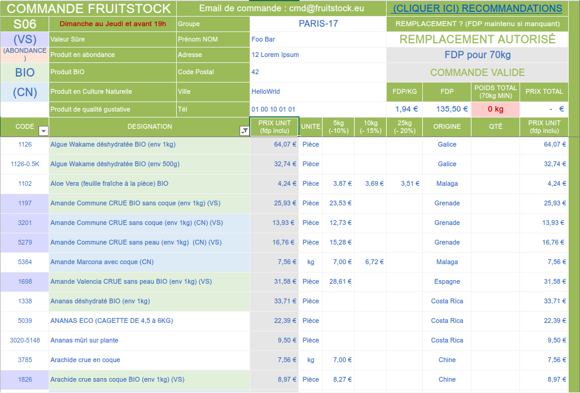

# Projet 42-Fruits

  

  <i>Crédit du logo : <a href="https://remidehaene.wixsite.com/design">Rémi Dehaene</a></i>

Fruitstock est une SARL spécialisée dans le secteur du commerce de détail de fruits et légumes.

Le fonctionnement est quasi similaire à celui d'une AMAP (Association pour le Maintien d'une Agriculture Paysanne) dans son fonctionnement :

Une AMAP naît en général de la rencontre d'un groupe de consommateurs et de paysans (ou artisans transformateurs) prêts à entrer dans la démarche. Ils établissent entre eux un contrat pour une (on distingue en général 2 saisons de production : printemps / été et automne / hiver), selon les modalités suivantes : [...]

Source : site du réseau AMAP.

La différence est que Fruitstock a déjà son réseau de producteurs et que la logistique (transport des marchandises) est assurée de leur côté.

Fruitstock a donc pour ambition de mettre en relation les personnes d'une même région et de leur permettre, à travers des groupements d'achats, de commander des fruits, oléagineux et légumes d'excellente qualité à un prix juste.

La majorité du catalogue de Fruitstock est soit Bio, en agriculture naturelle ou en permaculture. La société limite les produits importés, bien qu'ils soient toujours présents sur le catalogue.
Les denrées sont principalement produites sur le sol andalou, sur la côte tropicale de l'Espagne.

Un membre clé du projet Fruistock est le producteur / grossiste Rufino Ruiz Casado, gérant de la société Sol Y Fruta basée à Salobreña.
C'est cette société qui fournit principalement Fruitstock.

Fonctionnement

Chaque groupe d'achat est formé d'un responsable de groupe et de plusieurs adhérents. L'organisation d'une commande se fait donc entre pairs : commande, réception, distribution.
Le responsable est chargé de s'assurer que la commande soit sans erreur et propose différentes solutions aux adhérents du groupe pour la distribution.

Fiche de commande
Le début d'une commande se passe sur un fichier Excel :

  

Les prix sont dégressifs en fonction de la quantité d'un aliment.

Le prix au kilogramme peut paraître très élevé, mais heureusement, aux alentours des 100 kg de commandes, il baisse à moins de 90 centimes.

  

Sur cette capture d'écran, on peut remarquer :

La baisse du prix en fonction d'une certaine quantité : pour les Bananes Cavendish BIO, il y a un tarif dégressif qui passe de 6,15 euros / kg à 5,39 euros / kg pour des quantités supérieures à 10 kg.

Baisse du prix des frais de port (tout de même 1,08 euros / kg pour nous, Parisien).

Les bananes sont particulièrement chères (excellentes, heureusement!).

Pour des fruits de saison, les prix sont vraiment raisonnables, et surtout la qualité n'a même rien à voir avec ce qu'on peut trouver en magasin bio ici à Paris :

  

Le fonctionnement du tableau Excel est simple : chaque membre inscrit son prénom et son nom dans les colonnes adjacentes au catalogue, et inscrit la quantité souhaitée sur les lignes correspondantes.
Il faut au préalable s'inscrire sur le site de Fruitstock et demander au gérant de faire partie du groupe.

  

  

Le responsable du groupe est ensuite chargé de transmettre le fichier Excel à la société.

Il n'y a pas de minimum par personne, chacun décide de choisir ce qu'il prend mais il est préférable qu'il s'accorde avec les membres du groupe pour profiter des réductions au kilogramme, et pour faciliter le travail de répartition par la suite.

La seule contrainte est celle du poids : un minimum de 70 kg par commande.

Livraison
La livraison s'effectue généralement dans la semaine ou le lundi de la semaine suivante pour une commande passée le jeudi soir de la semaine précédente.
Il faut donc un espace suffisamment grand pour pouvoir stocker entre 100 et 200 kg de fruits et légumes pendant une journée ou deux jours au maximum.

C'est généralement un gros camion STG qui livre la palette.

Il y a un travail de répartition et de vérification du poids qui demande pas mal de temps : s'y mettre à plusieurs est idéal.

En plus du poids, il faut aussi s'assurer de l'état général de l'ensemble de la commande. Dans le cas où il y aurait un souci, le gérant doit pouvoir s'occuper de faire une fiche S.A.V, ce qui nous amène à la section suivante.

Distribution & Service Après-Vente
Chaque membre se débrouille donc pour venir chercher ce qu'il a commandé le jour même ou le lendemain.

Si jamais des fruits arrivent pourris, en très mauvais état ou ne se conservent pas, Fruitstock est généralement très réactif et très conciliant : avec une ou plusieurs photos à envoyer au gérant et une description du problème, la société répond positivement en proposant des avoirs sur la prochaine commande au membre concerné.

Le paiement
Généralement deux jours avant la livraison, Fruitstock envoie une facture par mail, à payer rapidement sur la plateforme Pennylane.

Il n'y a donc aucun transfert d'argent au responsable lui-même, ce processus est individualisé.

Pourquoi le projet peut s'intégrer parfaitement à l'école

Un groupe peut s'intégrer au sein de l'école : je me propose en tant que responsable, et je serai ravi de travailler avec d'autres personnes (d'autres élèves) pour la partie réception / communication au sein du groupe de l'école.
Il y a une dimension sociale intéressante qui, je pense, s'inscrit dans la philosophie de l'école : le groupe est autonome et son fonctionnement se réalise uniquement entre élèves, la communication est importante et son déploiement nécessite un effort collectif.
Pour ceux qui commandent de grosses quantités et qui ont une voiture, proposer aux autres de leur rendre service s'ils habitent dans un même quartier / secteur.
Le projet s'inscrit dans une dynamique actuelle.
Même si les produits viennent d'Espagne, c'est un circuit relativement court.
Enjeux de santé publique.
Besoin de proximité avec ce que l'on mange / lassitude des institutions de consommations actuelles.
Besoin(s)
Utilisation des locaux : un espace au sein de l'école pour le stockage.
Limite(s)
Si le projet a du succès, il y aura un moment où la somme de travail qui est demandée sera peut-être trop grande et imposera une limite de membres. L'expérience le montrera et j'expose ce point uniquement par prudence.

Contact
Adresse électronique : plouvel@42.student.fr

Discord : Noctuelles#1657
